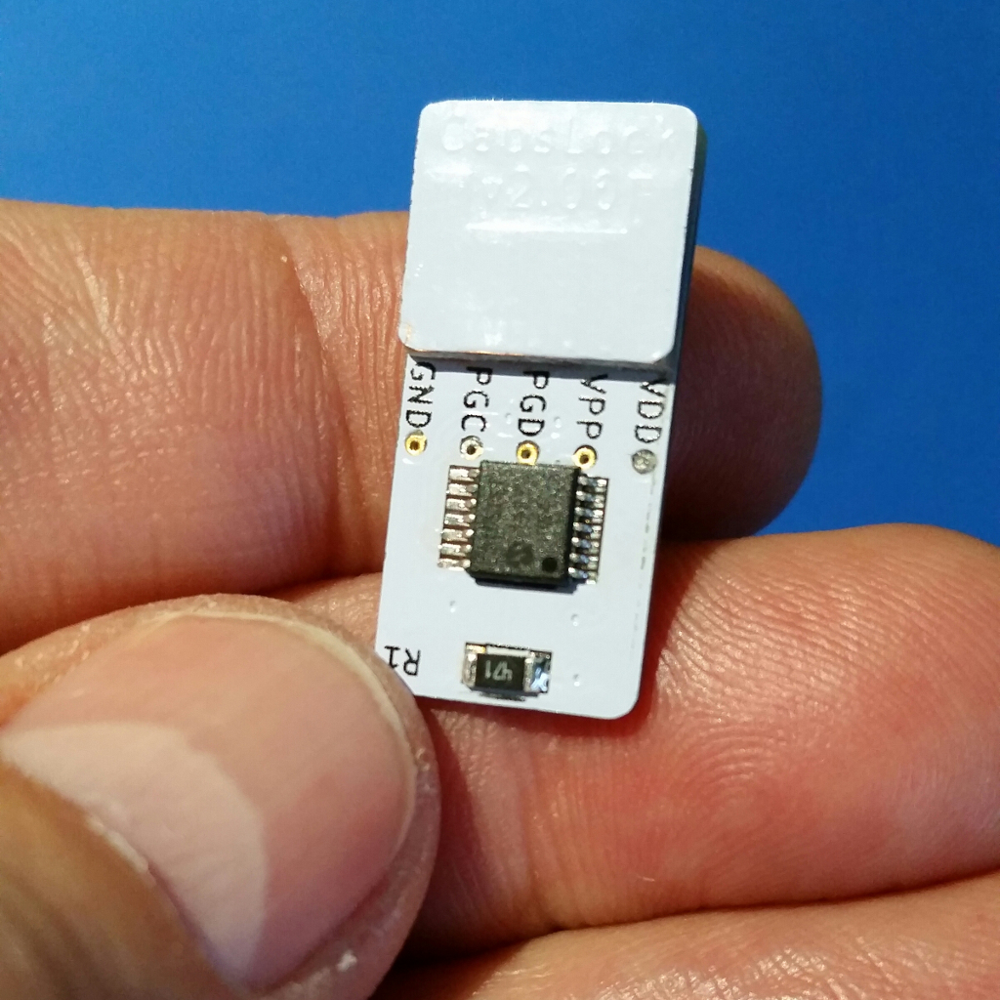

USB dongle that lights up when the capslock light is on
=========

This is a USB capslock-light-on-a-stick that lights up when the
CapsLock LED would normally be lit. Some Lenovo laptops do not have
a CapsLock LED.

In addition, the SCROLL LOCK keystroke
is sent to the host every 60 seconds to prevent the host from
detecting a "time out" situation.

The SCROLL LOCK light, present on many older keyboards, will flash
to indicate the keystroke injection is active. The LED on this
device will also briefly blink for each keystroke injection.

Operation
-----
Plug it in (relaxen und watschen der blinkenlichten)

Prototype
-----

